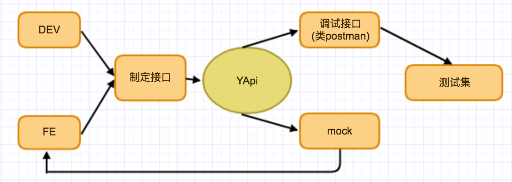

## YApi  可视化接口管理平台
示例站点：

<a target="_blank" href="http://yapi.demo.qunar.com">yapi.demo.qunar.com</a>

文档：

<a target="_blank" href="https://hellosean1025.github.io/yapi">hellosean1025.github.io/yapi</a>

### 平台介绍

YApi 是<strong>高效</strong>、<strong>易用</strong>、<strong>功能强大</strong>的 api 管理平台，旨在为开发、产品、测试人员提供更优雅的接口管理服务。可以帮助开发者轻松创建、发布、维护 API，YApi 还为用户提供了优秀的交互体验，开发人员只需利用平台提供的接口数据写入工具以及简单的点击操作就可以实现接口的管理。

**QQ交流群**:

644642474 **主群已满**

941802405 **群2欢迎加入**

### 特性
*  基于 Json5 和 Mockjs 定义接口返回数据的结构和文档，效率提升多倍
*  扁平化权限设计，即保证了大型企业级项目的管理，又保证了易用性
*  类似 postman 的接口调试
*  自动化测试, 支持对 Response 断言
*  MockServer 除支持普通的随机 mock 外，还增加了 Mock 期望功能，根据设置的请求过滤规则，返回期望数据
*  支持 postman, har, swagger 数据导入
*  免费开源，内网部署，信息再也不怕泄露了

### 内网部署
#### 环境要求
* nodejs（7.6+)
* mongodb（2.6+）
* git
#### 安装
使用我们提供的 yapi-cli 工具，部署 YApi 平台是非常容易的。执行 yapi server 启动可视化部署程序，输入相应的配置和点击开始部署，就能完成整个网站的部署。部署完成之后，可按照提示信息，执行 node/{网站路径/server/app.js} 启动服务器。在浏览器打开指定url, 点击登录输入您刚才设置的管理员邮箱，默认密码为 ymfe.org 登录系统（默认密码可在个人中心修改）。

    npm install -g yapi-cli --registry https://registry.npm.taobao.org
    yapi server 
    
#### 服务管理
利用pm2方便服务管理维护。

    npm install pm2 -g  //安装pm2
    cd  {项目目录}
    pm2 start "vendors/server/app.js" --name yapi //pm2管理yapi服务
    pm2 info yapi //查看服务信息
    pm2 stop yapi //停止服务
    pm2 restart yapi //重启服务

#### 升级
升级项目版本是非常容易的，并且不会影响已有的项目数据，只会同步 vendors 目录下的源码文件。
    
    cd  {项目目录}
    yapi ls //查看版本号列表
    yapi update //更新到最新版本
    yapi update -v {Version} //更新到指定版本
    
### 教程
* [使用 YApi 管理 API 文档，测试， mock](https://juejin.im/post/5acc879f6fb9a028c42e8822)
* [自动更新 Swagger 接口数据到 YApi 平台](https://juejin.im/post/5af500e251882567096140dd)
* [自动化测试](https://juejin.im/post/5a388892f265da430e4f4681)

### YApi 插件
* [yapi sso 登录插件](https://github.com/YMFE/yapi-plugin-qsso)
* [yapi cas 登录插件](https://github.com/wsfe/yapi-plugin-cas) By wsfe
* [yapi gitlab集成插件](https://github.com/cyj0122/yapi-plugin-gitlab)
* [oauth2.0登录](https://github.com/xwxsee2014/yapi-plugin-oauth2)
* [rap平台数据导入](https://github.com/wxxcarl/yapi-plugin-import-rap)
* [dingding](https://github.com/zgs225/yapi-plugin-dding) 钉钉机器人推送插件
* [export-docx-data](https://github.com/inceptiongt/Yapi-plugin-export-docx-data) 数据导出docx文档
* [interface-oauth-token](https://github.com/shouldnotappearcalm/yapi-plugin-interface-oauth2-token) 定时自动获取鉴权token的插件
* [import-swagger-customize](https://github.com/follow-my-heart/yapi-plugin-import-swagger-customize) 导入指定swagger接口

### 代码生成
* [yapi-to-typescript：根据 YApi 的接口定义生成 TypeScript 的请求函数](https://github.com/fjc0k/yapi-to-typescript)
* [yapi-gen-js-code: 根据 YApi 的接口定义生成 javascript 的请求函数](https://github.com/hellosean1025/yapi-gen-js-code)

### YApi docker部署（非官方）
* [使用 alpine 版 docker 镜像快速部署 yapi](https://www.jianshu.com/p/a97d2efb23c5)
* [docker-yapi](https://github.com/Ryan-Miao/docker-yapi)
* [docker-compose一键部署yapi](https://github.com/jinfeijie/yapi)
* [docker-YApi: 更易用的 YApi 镜像](https://github.com/fjc0k/docker-YApi)
* [使用DockerCompose构建部署Yapi](https://github.com/MyHerux/daily-code/blob/master/Program/%E5%B7%A5%E5%85%B7%E7%AF%87/Yapi/%E4%BD%BF%E7%94%A8DockerCompose%E6%9E%84%E5%BB%BA%E9%83%A8%E7%BD%B2Yapi.md)

### YApi 一些工具
* [mysql服务http工具,可配合做自动化测试](https://github.com/hellosean1025/http-mysql-server)
* [idea 一键上传接口到yapi插件](https://github.com/diwand/YapiIdeaUploadPlugin)
* [idea 接口上传调试插件 easy-yapi](https://github.com/tangcent/easy-yapi)

### YApi 的一些客户
* 去哪儿
* 携程
* 艺龙 
* 美团
* 百度
* 腾讯
* 阿里巴巴
* 京东
* 今日头条
* 唯品支付 
* 链家网
* 快手
* 便利蜂
* 中商惠民
* 新浪
* VIPKID
* 马蜂窝

### Authors
* [hellosean1025](https://github.com/hellosean1025)
* [gaoxiaomumu](https://github.com/gaoxiaomumu)
* [zwjamnsss](https://github.com/amnsss)
* [dwb1994](https://github.com/dwb1994)
* [fungezi](https://github.com/fungezi)

### License
Apache License 2.0

