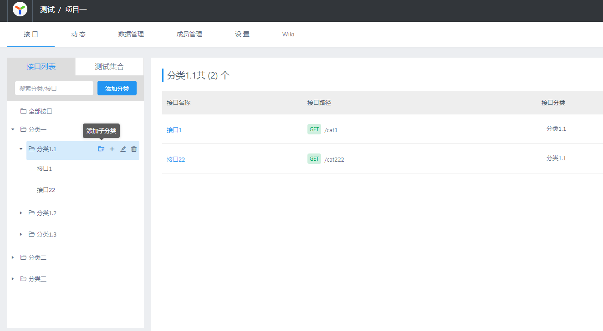

## YApi  可视化接口管理平台 （多级目录分支）

体验地址：

[https://yapi.feiyanyun.com/](https://yapi.feiyanyun.com/)  
账号：`admin@123.com`
密码：`123456`

<br/>

**喜欢的老铁,github求给个star❤️** 
[仓库地址](https://github.com/zybieku/yapi) 


> 参考图片 

  

<br/>

---

<br/>

### 分支介绍 
  * fork 官方 **api v1.10.2**
  - 主要支持`多级目录`,`添加子目录`
  - 支持不同层级`目录拖拽`
  - 支持多级`目录搜索`

---


### 内网部署
  - 需要事先安装 nodejs，mongodb  
  - 这里采用不同安装，部署的方式，大体上步骤和官方一样 


---

<br/>

 **方式一**：`zip包解压安装`  
    - 1 下载zip包，解压 [CSDN多级目录包](https://download.csdn.net/download/zybieku/34093967) , 或者 [百度网盘，提取码: 5qgk](https://pan.baidu.com/s/1wPwX0wW7StqoN5AIMvM5KA)    
    - 2 切换到 yapi 目录，修改config配置  
    - 3 切换到 vendors 目录，运行 npm run install-server （初始数据库，有库数据略过）  
    - 4 node server/app.js 启动（pm2亦可）  


---
<br/>

 #### 
  **方式二**  `git下载依赖`

  **1.创建工程目录**
  
  ```shell
   mkdir yapi && cd yapi   #或者手动创建目录   
   git clone https://github.com/zybieku/yapi.git vendors --depth=1 
  ```
 
  **2.修改配置,安装依赖**
  > config.json里面的内容，具体看官方

  ```shell
   #复制完成后请修改相关配置
   cp vendors/config_example.json ./config.json 
   # 指令打开config，或者用鼠标打开
   vi ./config.json 
   #再进入vendors
   cd vendors
   npm install --production --registry https://registry.npm.taobao.org
   #安装程序会初始化数据库，管理员账号名可在 config.json 配置
    npm run install-server 
  ``` 

 **5.启动（也可以使用pm2）** 

  ```shell
    #启动服务器后，#请访问 127.0.0.1:{config.json配置的端口}
    node server/app.js 
     # linux 后台模式 注意 nohup 与 & exit
    nohup  node server/app.js exit    
  ```
---
 **常见问题**

 - 1. 依赖报错
 一般依赖报错是由于 yapi的很多依赖库版本有点旧 ，需要手动锁定版本

 - 2. node-sass node-gyp  安装不上 
   可能是node-gyp没安装
   ```shell
    npm install -g node-gyp
    npm rebuild node-gyp
   ```
 
 - 3. 没有ykit指令    
   npm install -g ykit

---
   
 #### 
  **方式三**  `docker容器`  
   待定