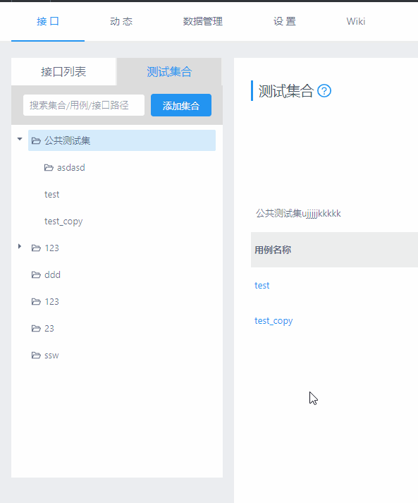
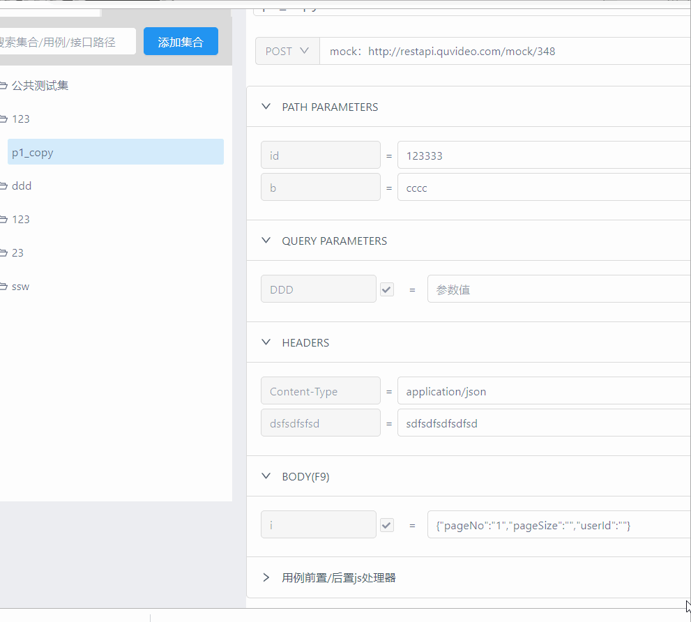
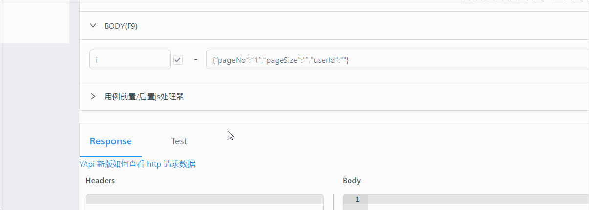
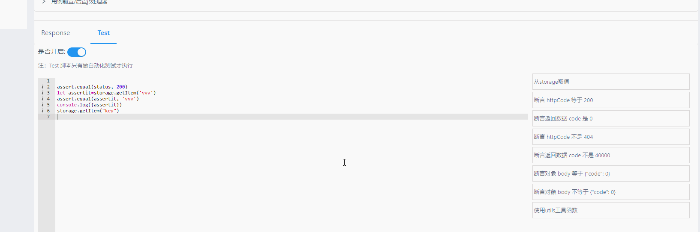

###   crazy-yapi分支补充功能说明：

#### TO DO

- [ ] 调研：支持文件上传类接口测试（计划采用二进制方式支持文件上传）
- [ ] 优化tree加载为异步
- [ ] 增强：增加jmeter driver服务，支持性能压测
- [ ] 精度bug修复 ：js 数字最大16位
- [ ] 公共参数备注链接
- [ ] 用例执行统计报表
- [ ] 接口统计报表

### 2019/11/15
* 优化： 改进接口和测试集相关的请求，提升在网络较慢时的使用体验。
* 新增： 接口和测试集树状列表可拖动调节宽度。
* 新增： 测试集新加数量统计

### 2019/10/17

* 优化： 鼠标选中搜索结果，会展示完整的数据。
* 修复： 菜单树诸多问题 [#27](https://github.com/xian-crazy/yapi/issues/27) [#10](https://github.com/xian-crazy/yapi/issues/10)
* 优化： 接口列表箭头可点击 [#11](https://github.com/xian-crazy/yapi/issues/11)
* 新增： 高级参数设置-常量 添加安全常量输入， 解决转换失败的问题 [#28](https://github.com/xian-crazy/yapi/issues/28)
* 优化： 接口请求时控制台展示 [#5](https://github.com/xian-crazy/yapi/issues/5)

### 2019/8/16

*  修复bug:  #12 项目设置中使用swagger同步接口，提示interface_cat validation failed:parent_id:Path'parent_id'is required

### 2019/8/14

*   优化：body参数示例状态可直接编辑，状态变为自定义状态
*   新增功能：支持multipart/form-data格式请求（后续会在此基础上开发chrome环境下文件上传功能）

### 2019/8/6
*   修复： 接口运行页面 保存到用例集，不支持用例集树结构的bug
*   优化： 增加用例全局【切换参数】按钮，点击按钮，当前用例 **所有参数** 在 示例数据 和参数值 之间切换
*   修复 ：用例没有test脚本时，在页面点击 开始测试  后，所有用例执行失败，提示Cannot read property 'length' of undefined

### 2019/8/2
*   修复了 接口 运行 页面 执行无返回信息的bug
*   修复了 项目复制报错的bug

2019/8/1
*  crazy-yapi发布演示站点
*  配置crazy-yapi升级提醒

2019/7/31
*  变更：去掉依赖跨域插件，PS：去除跨域插件后，测试请求均从yapiserver发起，因此需要部署yapi的服务器能够与被测服务的环境配置进行http通信
*  test 断言功能加强：支持storage，支持工具函数utils
*   优化，断言执行失败，在用例执行页面显示error信息

2019/7/30
*  增加复选框，包含子用例集合（兼容【开始测试】）
*  服务器测试兼容多级目录，可设置是否执行子集合用例

2019/7/26
*  调整删除分类逻辑：删除父分类，则删除其子分类及其分类下得接口/用例
*  getbypath  开放接口 权限修复

2019/7/26
*  用例跨项目移动支持多级目录
*  用例参数在接口示例参数和用例设置值间切换（导入接口设置参数）

2019/7/25
*  依赖组件升级 antd版本升级到3.20.5
*  用例集支持多级目录
*  用例集支持 集合名/用例名/用例关联的接口path 搜索
*  修复接口列表 测试集合  tree 乱跳bug
*  优化了tree的点击展开及拖拽移动的交互逻辑

2019/7/23
*  增加：选择父分类后，接口列表页 复选框【包含子分类接口】
*  增加open api  根据接口path(完全匹配)查找接口：例如：http://127.0.0.1/api/interface/getbypath?token=xxxx&&path=/a
*  接口 /api/interface/list_menu  增加 islist参数，默认不传返回的是多级目录tree，例/api/interface/list_menu?project_id=348&islist=1
*  修复 测试用例集合 导入接口支持接口多级分类

2019/7/22
*  修复接口列表分页bug
*  修复搜索接口bug
*  增加：搜索接口时，过滤未命中的分类
*  增加：命中的关键字高亮显示
*  增加：树目录中接口增加状态显示
*  修复接口列表接口状态修改后，分类树中接口状态不变更的bug

2019/7/20

*  修复接口列表页面  table中 子分类显示id的bug
*   增加接口列表页面 table中支持treeselect选择子分类修改的功能
*  优化：接口列表页面搜索时，未命中的分类/接口，不显示

2019/7/19
*  增加接口列表多级目录
*  支持多级目录拖拽移动，修复各种坑死人不偿命bug
*  接口列表页【搜索接口】支持搜索子目录接口
*  添加接口接口筛选子目录
*  跨项目移动接口支持筛选子目录

2019/7/16
*  修复接口列表状态过滤分页异常的bug（bug:状态过滤后，却任然按照过滤前的数据分页展示）
*  接口列表头增加当前分类的接口状态统计 如：全部接口共 (30) 个,其中：["开发中: 1 个","已发布: 29 个"]

2019/7/15前
*  接口定义中参数示例参数如果是json格式，则会进行染色并格式化
*  增加接口/用例空间内跨项目移动功能
*  全局搜索增加支持接口路劲搜索（不包含basepath）
*  修复form参数批量导入时，示例值中包含冒号，导入后冒号后面内容丢失的bug
*  优化查询参数示例显示宽度为自适应
*  增加接口状态（从原来的未完成-已完成  改为： 设计中，开发中，已提测，已发布，已过时，暂停开发 ）
*  增加用例前置/后置脚本处理器，兼容context、storage，执行顺序：项目请求前置脚本-》用例前置脚本-》用例后置脚本-》项目响应处理脚本
*  在F12-console控制台打印用例执行的context内容，减小对cross控制台查看请求参数的依赖
*  在控制台打印请求配置脚本以及前置后置js脚本的异常错误，提高调试效率
*  请求超时时间从5秒修改为10秒
*   post form 参数增加list类型
    -  当参数类型为list时，value以“,”逗号分隔符连接多个value  如 value1,value2,value3;
    -   例子：form data:

        name=zhang2
        name=lisi

## 特性功能演示：

### 接口多级目录：

### 用例多级目录：

### 用例导入示例参数

### 单用例前置后置js处理器（支持context storage）

### 包含子用例集

### test断言功能增强

### 当前分支用户（使用当前分支的请提交issure，用的人越多 功能支持更新越快）
*   小影
*   CNGTZ

### 分支部署说明

#### 环境要求
* nodejs（7.6+)
* mongodb（2.6+）   https://docs.mongodb.com/manual/tutorial/install-mongodb-on-red-hat/
* git
* forever
* ykit
* chrome  开启跨域 设置教程见：http://crazy-yapi.camdy.cn/doc/documents/chromeCORS.html

####  crazy-yapi 分支部署

    mkdir crazy-yapi
    cd crazy-yapi
    git clone --depth=1  https://github.com/xian-crazy/yapi.git vendors
    cp vendors/config_example.json ./config.json //复制完成后请修改相关配置（先在mongodb中创建好数据库和账户，根据实际值修改config.json）
    cd vendors
    npm install  --registry https://registry.npm.taobao.org
    ykit pack -m   //大概60秒左右 编译过程中 如果显示 [Bundler] 1908/1912 build modules 不动了，按一下回车
    npm run install-server //安装程序会初始化数据库索引和管理员账号，管理员账号名可在 config.json 配置
    forever start -o out.log -e err.log server/app.js  //启动服务器后，请访问 127.0.0.1:{config.json配置的端口}，初次运行会有个编译的过程，请耐心等候

### 分支升级说明
1. 停止服务：forever stopall
2. cd xxx/yapi/vendors/
3. 添加 分支仓库（若已经添加，无需重复添加） git remote add yehaoapi https://github.com/xian-crazy/yapi.git
4. 拉取新代码 git pull yehaoapi master
5. 打包 ykit pack -m
6. 启动服务 forever start -o out.log -e err.log server/app.js

### crazy-yapi 分支 作者
* crazy  330126160@qq.com
* BetaGo  gouwantong@live.com

### crazy-yapi 分支 License

Copyright © 2019, [小影](http://quvideo.com/).
Released under the [Apache License 2.0](LICENSE).

 ---------------------以下内容为官方主分支说明文档------------------------------

## YApi  可视化接口管理平台

<a target="_blank" href="http://yapi.demo.qunar.com">yapi.demo.qunar.com</a>

### 平台介绍

YApi 是<strong>高效</strong>、<strong>易用</strong>、<strong>功能强大</strong>的 api 管理平台，旨在为开发、产品、测试人员提供更优雅的接口管理服务。可以帮助开发者轻松创建、发布、维护 API，YApi 还为用户提供了优秀的交互体验，开发人员只需利用平台提供的接口数据写入工具以及简单的点击操作就可以实现接口的管理。

**QQ交流群**: 644642474

### 特性
*  基于 Json5 和 Mockjs 定义接口返回数据的结构和文档，效率提升多倍
*  扁平化权限设计，即保证了大型企业级项目的管理，又保证了易用性
*  类似 postman 的接口调试
*  自动化测试, 支持对 Response 断言
*  MockServer 除支持普通的随机 mock 外，还增加了 Mock 期望功能，根据设置的请求过滤规则，返回期望数据
*  支持 postman, har, swagger 数据导入
*  免费开源，内网部署，信息再也不怕泄露了

### 内网部署
#### 环境要求
* nodejs（7.6+)
* mongodb（2.6+）
* git
#### 安装
使用我们提供的 yapi-cli 工具，部署 YApi 平台是非常容易的。执行 yapi server 启动可视化部署程序，输入相应的配置和点击开始部署，就能完成整个网站的部署。部署完成之后，可按照提示信息，执行 node/{网站路径/server/app.js} 启动服务器。在浏览器打开指定url, 点击登录输入您刚才设置的管理员邮箱，默认密码为 ymfe.org 登录系统（默认密码可在个人中心修改）。

    npm install -g yapi-cli --registry https://registry.npm.taobao.org
    yapi server 

#### 升级
升级项目版本是非常容易的，并且不会影响已有的项目数据，只会同步 vendors 目录下的源码文件。

    cd  {项目目录}
    yapi ls //查看版本号列表
    yapi update //更新到最新版本
    yapi update -v {Version} //更新到指定版本
    
### 教程
* [使用 YApi 管理 API 文档，测试， mock](https://juejin.im/post/5acc879f6fb9a028c42e8822)
* [自动更新 Swagger 接口数据到 YApi 平台](https://juejin.im/post/5af500e251882567096140dd)
* [自动化测试](https://juejin.im/post/5a388892f265da430e4f4681)

### YApi 插件
* [yapi sso 登录插件](https://github.com/YMFE/yapi-plugin-qsso)
* [yapi cas 登录插件](https://github.com/wsfe/yapi-plugin-cas) By wsfe
* [yapi gitlab集成插件](https://github.com/cyj0122/yapi-plugin-gitlab)
* [oauth2.0登录](https://github.com/xwxsee2014/yapi-plugin-oauth2)
* [rap平台数据导入](https://github.com/wxxcarl/yapi-plugin-import-rap)
* [dingding](https://github.com/zgs225/yapi-plugin-dding) 钉钉机器人推送插件
* [export-docx-data](https://github.com/inceptiongt/Yapi-plugin-export-docx-data) 数据导出docx文档

### 代码生成
* [yapi-to-typescript：根据 YApi 的接口定义生成 TypeScript 的请求函数](https://github.com/fjc0k/yapi-to-typescript)
* [yapi-gen-js-code: 根据 YApi 的接口定义生成 javascript 的请求函数](https://github.com/hellosean1025/yapi-gen-js-code)

### YApi docker部署（非官方）
* [使用 alpine 版 docker 镜像快速部署 yapi](https://www.jianshu.com/p/a97d2efb23c5)
* [docker-yapi](https://github.com/Ryan-Miao/docker-yapi)

### YApi 一些工具
* [mysql服务http工具,可配合做自动化测试](https://github.com/hellosean1025/http-mysql-server)
* [idea 一键上传接口到yapi插件](https://github.com/FurionCS/YapiIdeaUploadPlugin)

### YApi 主分支 的一些客户
* 去哪儿
* 携程
* 艺龙 
* 美团
* 百度
* 腾讯
* 阿里巴巴
* 京东
* 今日头条
* 唯品支付 
* 链家网
* 快手
* 便利蜂
* 中商惠民
* 新浪
* VIPKID

### 主分支 Authors
* [hellosean1025](https://github.com/hellosean1025)
* [gaoxiaomumu](https://github.com/gaoxiaomumu)
* [zwjamnsss](https://github.com/amnsss)
* [dwb1994](https://github.com/dwb1994)
* [fungezi](https://github.com/fungezi)

### License
Apache License 2.0

