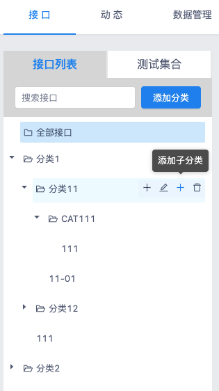

## YApi  可视化接口管理平台

官方文档：

<a target="_blank" href="https://hellosean1025.github.io/yapi">hellosean1025.github.io/yapi</a>

## 新增特性
- [x] 支持多级分类
- [x] 支持多级目录导出HTML文件

## 待办
- [x] 支持多级分类
- [ ] 搜索接口BUG修复
- [x] 支持多级目录导出HTML文件
- [ ] 修复多级目录导出HTML文件样式上的BUG

## 预览

