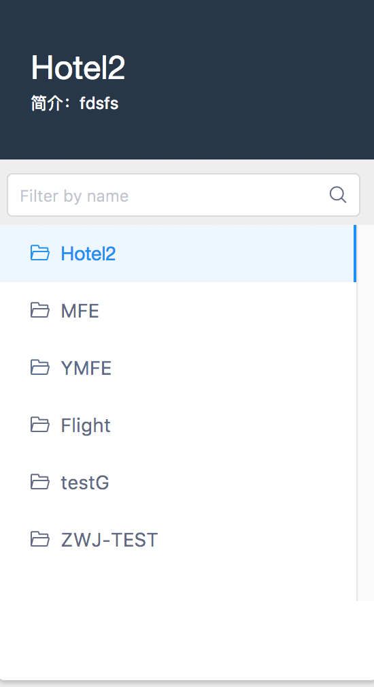
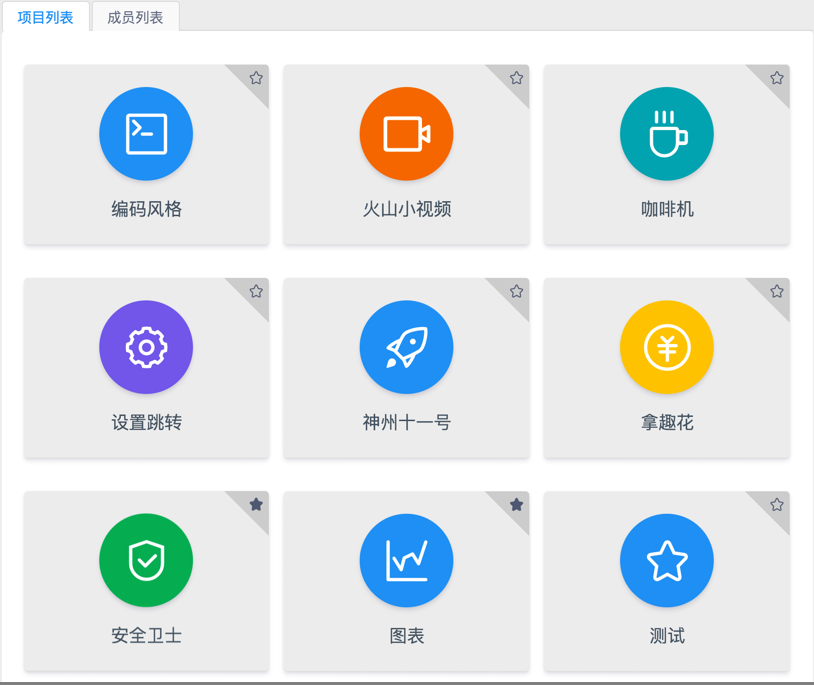
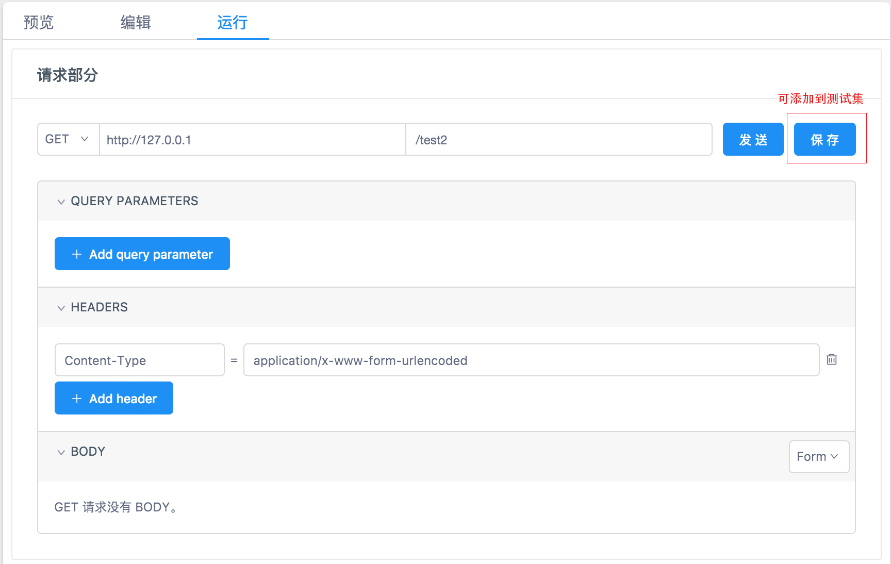

## 快速开始
### 1 创建项目分组

登录之后进到项目首页，左边侧边栏显示的即分组列表。

联系管理员添加分组并且把你设置为组长或让组长邀请你加入到某项目分组

#### 2 项目列表

选中不同的分组，右边会显示该分组下的项目列表。

### 3 添加项目

#### 3.1 点击右上角的“+“号进入添加项目页面

#### 3.2 添加项目页面

添加完成后进去项目详情页面

### 4 项目详情页面

#### 4.1 添加接口分类

添加完成后可以在左侧列表看到新添加的接口分类

#### 4.2 添加接口
鼠标移动到接口分类的菜单icon，点击添加接口

#### 4.3 接口编辑
添加完接口点击新添加的接口，跳转到接口预览页面，可看到刚才填写的信息。接口的详细信息点击编辑功能进行添加

#### 4.4 测试接口
点击运行tab,可进入到接口测试页面，首先安装chrome crossRequest扩展，才可正常使用此功能

点击保存按钮可把当前测试保存到测试集，方便下次调试