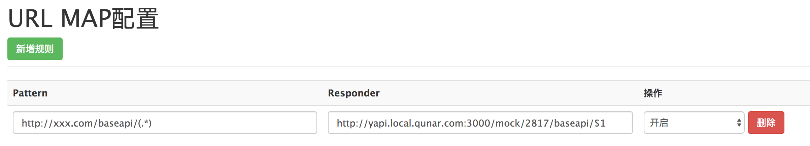

## Mock介绍

 <p style='text-indent:2em;line-height:1.8em'>yapi的Mock功能可以根据用户的输入接口信息如协议、URL、接口名、请求头、请求参数、mock规则([点击到Mock规则](#mock)）生成Mock接口，这些接口会自动生成模拟数据，创建者可以自由构造需要的数据。而且与常见的Mock方式如将Mock写在代码里和JS拦截等相比yapi的Mock在使用场景和效率和复杂度上是相差甚远的，正是由于yapi的Mock是一个第三方平台，那么在团队开发时任何人都可以权限许可下创建、修改接口信息等操作，这对于团队开发是很有好处的。
 
 **mock地址解析**：yapi平台网址+mock+**您的项目id**+**接口实际请求path**

 注：项目id可以在项目设置里查看到
 
 </p>


### 1 如何使用Mock?
### 1.1 最简单最直接的方式
在代码直接请求yapi提供的mock地址，以jQuery为例：

````javascript
let prefix = 'http://yapi.local.qunar.com:3000/mock/2817'
$.post(prefix+'/baseapi/path', {username: 'xxx'}, function(res){
    console.log(res) //返回上图预览部分的数据
})
````

### 1.2 基于本地服务器反向代理

优点:不用修改项目代码

#### 1.2.1 基于nginx反向代理

```` nginx
location /baseapi
{
proxy_pass   http://yapi.local.qunar.com:3000/mock/2817/baseapi; #baseapi后面没有"/"
}
````

#### 1.2.2 基于ykit Jerry代理

假设您本地服务器访问地址是： http://xxx.com




<span id = "mock"></span>


### 2.1 Mock语法规范
>了解更多Mock详情：[Mock.js 官方文档](https://github.com/nuysoft/Mock/wiki/Syntax-Specification)

Mock.js 的语法规范包括两部分：

[1. 数据模板定义规范（Data Template Definition，DTD）](#DTD)

[2. 数据占位符定义规范（Data Placeholder Definition，DPD）](#DPD)

<span id = "DTD"></span>
### 数据模板定义规范（Data Template Definition，DTD）

数据模板中的每个属性由 3 部分构成：属性名、生成规则、属性值：


```
// 属性名   name （与生成规则之间用 "|" 隔开）
// 生成规则 rule（生成规则有7种详见下面的生成规则）
// 属性值   value（可以含有 "@占位符" 同时也指定了最终值的初始值和类型）

'name|rule': value

生成规则：
'name|min-max': value
'name|count': value
'name|min-max.dmin-dmax': value
'name|min-max.dcount': value
'name|count.dmin-dmax': value
'name|count.dcount': value
'name|+step': value
```

下面提供了6种生成规则以及示例包括 String、Number、Boolean、Object、Array：

#### 1. 属性值是字符串 String

```
1. 'name|min-max': string

通过重复 string 生成一个字符串，重复次数大于等于 min，小于等于 max。

2. 'name|count': string

通过重复 string 生成一个字符串，重复次数等于 count。
```
#### 2. 属性值是数字 Number
```
1. 'name|+1': number

属性值自动加 1，初始值为 number。

2. 'name|min-max': number

生成一个大于等于 min、小于等于 max 的整数，属性值 number 只是用来确定类型。

3. 'name|min-max.dmin-dmax': number

生成一个浮点数，整数部分大于等于 min、小于等于 max，小数部分保留 dmin 到 dmax 位。

例如：
Mock.mock({
    'number1|1-100.1-10': 1,
    'number2|123.1-10': 1,
    'number3|123.3': 1,
    'number4|123.10': 1.123
})
// =>
{
    "number1": 12.92,
    "number2": 123.51,
    "number3": 123.777,
    "number4": 123.1231091814
}
```

#### 3. 属性值是布尔型 Boolean
```
1. 'name|1': boolean

随机生成一个布尔值，值为 true 的概率是 1/2，值为 false 的概率同样是 1/2。

2. 'name|min-max': value

随机生成一个布尔值，值为 value 的概率是 min / (min + max)，值为 !value 的概率是 max / (min + max)。
```
#### 4. 属性值是对象 Object
```
1. 'name|count': object

从属性值 object 中随机选取 count 个属性。

2. 'name|min-max': object

从属性值 object 中随机选取 min 到 max 个属性。
```
#### 5. 属性值是数组 Array
```
1. 'name|1': array

从属性值 array 中随机选取 1 个元素，作为最终值。

2. 'name|+1': array

从属性值 array 中顺序选取 1 个元素，作为最终值。

3. 'name|min-max': array

通过重复属性值 array 生成一个新数组，重复次数大于等于 min，小于等于 max。

4. 'name|count': array

通过重复属性值 array 生成一个新数组，重复次数为 count。
```

<span id = "DPD"></span>
### 数据占位符定义规范（Data Placeholder Definition，DPD）
```
占位符 只是在属性值字符串中占个位置，并不出现在最终的属性值中。

占位符 的格式为：

@占位符

说明：
1. 用 @ 来标识其后的字符串是 占位符，在YApi提供的Mock输入框在输入“@”后会自动提示占位符。

例如：
name: {
    first: '@FIRST',
    middle: '@FIRST',
    last: '@LAST',
    full: '@first @middle @last'
}
// 上面的示例可以得到如下结果：
"name": {
    "first": "Charles",
    "middle": "Brenda",
    "last": "Lopez",
    "full": "Charles Brenda Lopez"
}
```
