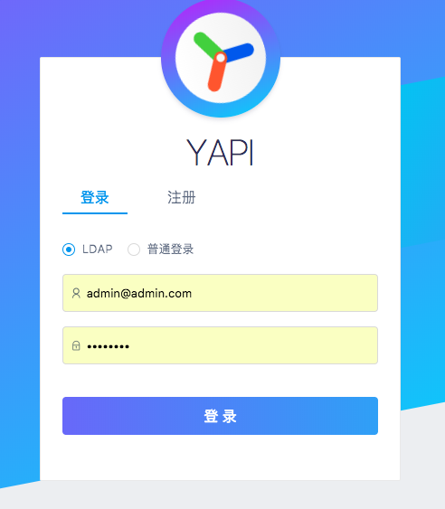

# 内网部署
使用我们提供的 yapi-cli 工具，部署 YApi 平台是非常容易的。建议部署成 http 站点，因 chrome 浏览器安全限制，部署成 https 会导致测试功能在请求 http 站点时文件上传功能异常。

如果您是将服务器代理到 nginx 服务器，请配置 nginx 支持 websocket。
```
在location /添加
proxy_http_version 1.1;
proxy_set_header Upgrade $http_upgrade;
proxy_set_header Connection "upgrade";
```

## 环境要求
* nodejs（7.6+)
* mongodb（2.6+）


## 安装
### 方式一. 可视化部署[推荐]
执行 yapi server 启动可视化部署程序，输入相应的配置和点击开始部署，就能完成整个网站的部署。部署完成之后，可按照提示信息，执行 node/{网站路径/server/app.js} 启动服务器。在浏览器打开指定url, 点击登录输入您刚才设置的管理员邮箱，默认密码(ymfe.org) 登录系统（默认密码可在个人中心修改）。
```bash
npm install -g yapi-cli --registry https://registry.npm.taobao.org
yapi server
``` 
### 方式二. 命令行部署

如果 github 压缩文件无法下载，或需要部署到一些特殊的服务器，可尝试此方法

```bash
mkdir yapi
cd yapi
git clone https://github.com/YMFE/yapi.git vendors //或者下载 zip 包解压到 vendors 目录（clone 整个仓库大概 140+ M，可以通过 `git clone --depth=1 https://github.com/YMFE/yapi.git vendors` 命令减少，大概 10+ M）
cp vendors/config_example.json ./config.json //复制完成后请修改相关配置
cd vendors
npm install --production --registry https://registry.npm.taobao.org
npm run install-server //安装程序会初始化数据库索引和管理员账号，管理员账号名可在 config.json 配置
node server/app.js //启动服务器后，请访问 127.0.0.1:{config.json配置的端口}，初次运行会有个编译的过程，请耐心等候
```

安装后的目录结构如下：

```
|-- config.json
|-- init.lock
|-- log
`-- vendors
    |-- CHANGELOG.md
    |-- LICENSE
    |-- README.md
    |-- client
    |-- common
    |-- config_example.json
    |-- doc
    |-- exts
    |-- nodemon.json
    |-- npm-debug.log
    |-- package.json
    |-- plugin.json
    |-- server
    |-- static
    |-- test
    |-- webpack.alias.js
    |-- yapi-base-flow.jpg
    |-- ydocfile.js
    `-- ykit.config.js
```

## 服务器管理

推荐使用 pm2 管理 node 服务器启动，停止，具体使用方法可参考下面的教程：
* <a href="http://pm2.keymetrics.io/docs/usage/quick-start/" target="_blank">官网文档</a>
* <a href="http://imweb.io/topic/57c8cbb27f226f687b365636" target="_blank">PM2实用入门指南</a> 

## 升级
升级项目版本是非常容易的，并且不会影响已有的项目数据，只会同步 vendors 目录下的源码文件。

    cd  {项目目录}
    yapi ls //查看版本号列表
    yapi update //升级到最新版本
    yapi update -v v1.1.0 //升级到指定版本

## 配置邮箱
打开项目目录 config.json 文件，新增 mail 配置， 替换默认的邮箱配置
```json
{
  "port": "*****",
  "adminAccount": "********",
  "db": {...},
  "mail": {
    "enable": true,
    "host": "smtp.163.com",    //邮箱服务器
    "port": 465,               //端口
    "from": "***@163.com",     //发送人邮箱
    "auth": {
        "user": "***@163.com", //邮箱服务器账号
        "pass": "*****"        //邮箱服务器密码
    }
  }
}
```
如何申请STMP服务器账号和密码可以参考下面的教程：<a href="https://jingyan.baidu.com/article/fdbd42771da9b0b89e3f48a8.html" target="_blank">如何开通电子邮箱的SMTP功能</a>


## 配置LDAP登录
     
打开项目目录 config.json 文件，添加如下字段：   

```json
{
  "port": "*****",
  "adminAccount": "********",
  "db": {...},
  "mail": {...},
  "ldapLogin": {
      "enable": true,
      "server": "ldap://l-ldapt1.com",
      "baseDn": "CN=Admin,CN=Users,DC=test,DC=com",
      "bindPassword": "password123",
      "searchDn": "OU=UserContainer,DC=test,DC=com",
      "searchStandard": "mail",    // 自定义格式： "searchStandard": "&(objectClass=user)(cn=%s)"
      "emailPostfix": "@163.com",
      "emailKey": "mail",
      "usernameKey": "name"
   }
}

```   
这里面的配置项含义如下：  

- `enable` 表示是否配置 LDAP 登录，true(支持 LDAP登录 )/false(不支持LDAP登录);
- `server ` LDAP 服务器地址，前面需要加上 ldap:// 前缀，也可以是 ldaps:// 表示是通过 SSL 连接;
- `baseDn` LDAP 服务器的登录用户名，必须是从根结点到用户节点的全路径(非必须);
- `bindPassword` 登录该 LDAP 服务器的密码(非必须);
- `searchDn` 查询用户数据的路径，类似数据库中的一张表的地址，注意这里也必须是全路径;
- `searchStandard` 查询条件，这里是 mail 表示查询用户信息是通过邮箱信息来查询的。注意，该字段信息与LDAP数据库存储数据的字段相对应，如果如果存储用户邮箱信息的字段是 email,  这里就需要修改成 email.（1.3.18+支持）自定义filter表达式，基本形式为：&(objectClass=user)(cn=%s), 其中%s会被username替换
- `emailPostfix` 登陆邮箱后缀（非必须）
- `emailKey`: ldap数据库存放邮箱信息的字段（v1.3.21 新增 非必须）
- `usernameKey`: ldap数据库存放用户名信息的字段（v1.3.21 新增 非必须）


重启服务器后，可以在登录页看到如下画面，说明 ladp 配置成功




## 禁止注册
在 config.json 添加 `closeRegister:true` 配置项,就可以禁止用户注册 yapi 平台，修改完成后，请重启 yapi 服务器。

```json
{
  "port": "*****",
  "closeRegister":true
}

```

## 版本通知
（v1.3.19+ 增加）在 config.json 添加 `"versionNotify": true` 配置项，就可以开启版本通知功能，默认为 `false`，修改完成后，请重启 yapi 服务器。

```json
{
  "port": "******",
  "adminAccount": "*****",
  "versionNotify": true
}

```


### 如何配置mongodb集群

请升级到 yapi >= **1.4.0**以上版本，然后在 config.json db项，配置 connectString:

```json

{
  "port": "***",
  "db": {
    "connectString": "mongodb://127.0.0.100:8418,127.0.0.101:8418,127.0.0.102:8418/yapidb?slaveOk=true",
    "user": "******",
    "pass": "******"
  },
}

```

详细配置参考： [wiki](https://mongoosejs.com/docs/connections.html#multiple_connections)
