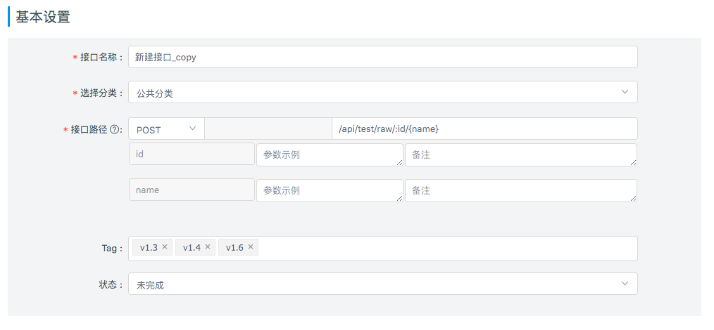
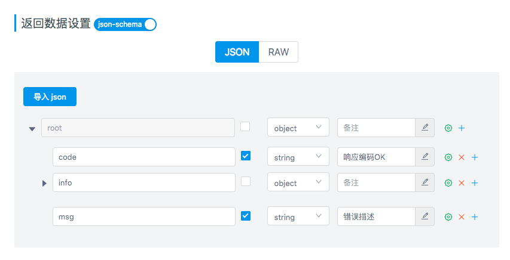
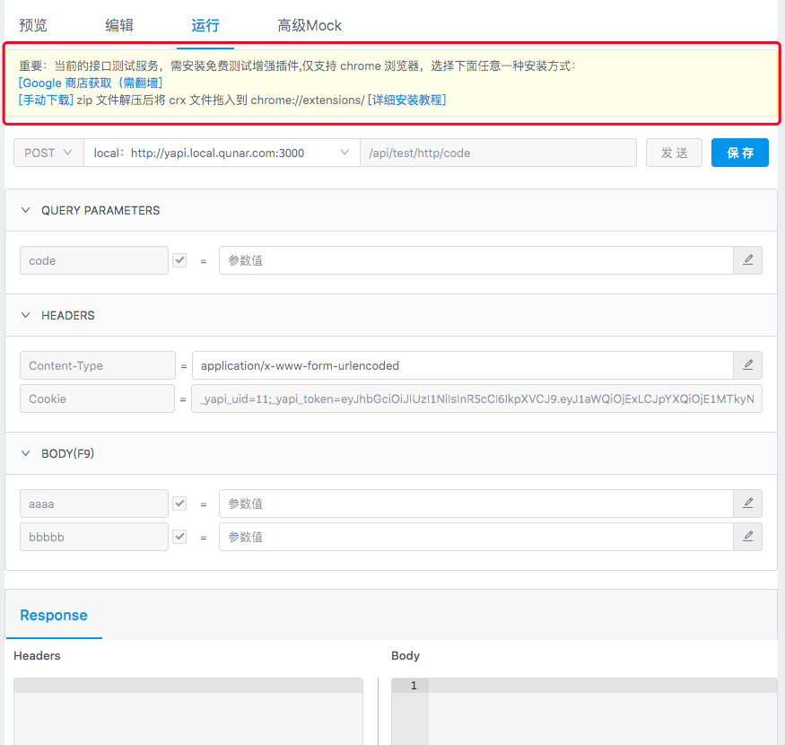
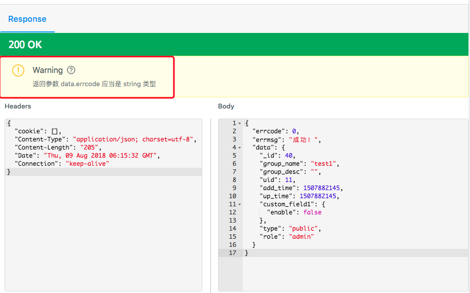

# 接口设置
进入项目页，可以看到项目下的所有接口，需要注意的是，YApi有 `接口集合` 和 `测试集合` 两个概念。

- `接口集合` 将接口进行分类，使接口结构更清晰，一个接口只能属于一个集合，且不允许与其他接口重名。
- `测试集合` 为了方便我们测试接口，`测试集合` 将若干接口组合在一起，在这里一个接口可以属于不同集合。

## 接口配置

[新建接口](./quickstart.md#新建接口) 后，点击新添加的接口，右侧可以看到接口的预览信息，点击右侧的 `编辑` Tab项进入编辑面板。

在该面板中你可以看到接口的基本信息(接口名称、分类、路径)，除此以外，你还可以完善以下接口信息：

### 基本设置

- 接口路径：可以更改 HTTP 请求方式，并且支持 restful 动态路由，例如 /api/{id}/{name}, id和name是动态参数
- 选择分类：可以更改接口所在分类
- 状态：用于标识接口是否开发完成。
- Tag：用于标识接口tag信息（v1.3.23+）,在接口list页可以根据tag过滤接口

### 请求参数设置

- Query参数： 接口 url 的查询字符串，点击『添加Query参数』按钮来添加参数，可以通过拖动来交换参数位置
- 请求Body：http 请求 body 部分，如果http请求方式是 post, put 等请求方式时会有 req_body 部分。req_body_type 形式有4种，分别是 form, json, file 和 raw 。
- Headers:  http 请求头字段，在 req_body 形式是 form 格式下会在 header 中自动生成 'Content-Type	application/x-www-form-urlencoded'，其他3种格式也会自动生成不同 header

### 返回数据设置

- 返回数据分为 `json` & `raw` 两种形式。基于 mockjs （具体使用方法详见[Mock 介绍](./mock.md)）和 json5，使用注释方式写参数说明。 为了方便数据编写可以按F9来使用全局编辑
- 选择json-schema 则进入了 json 结构可视化编辑器形式, 数据以 json schema 格式解析 <a  target="_blank" href="https://www.jianshu.com/p/8278eb2458c4?winzoom=1">快速入门 Json Schema </a>。

### 备注 & 其他
- 接口描述: 用简短的文字描述接口的作用。
- 邮件通知：开启后将此次接口的改动以邮件的形式发送至项目组所有成员和关注该项目的成员（邮件默认情况下自动开启）
- 开放接口：默认为关闭状态，用户可以在 数据导出 时选择只导出公开接口

## 接口运行
接口运行功能，是用来测试真实接口的，类似『Postman』的功能。

点击运行 tab ,可进入到接口测试页面，首先安装『chrome crossRequest』扩展，才可正常使用此功能。

点击保存按钮可把当前接口保存到测试集，方便下次调试。

> 安装完插件记得刷新页面

### 接口返回数据验证

版本 v1.3.22 新增返回数据验证功能， 如果接口的返回数据格式为json schema 在接口运行时会对接口返回数据和定义数据格式进行校验

