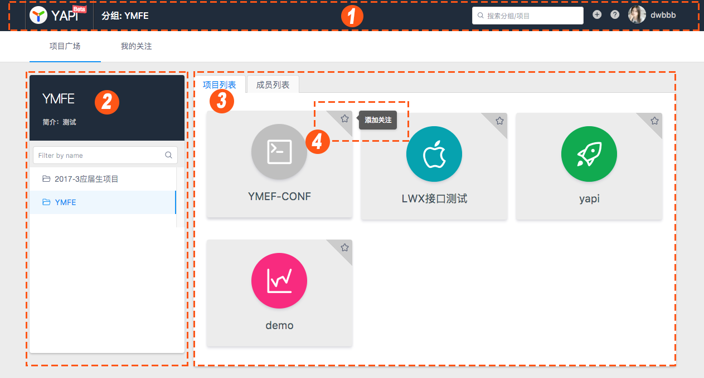
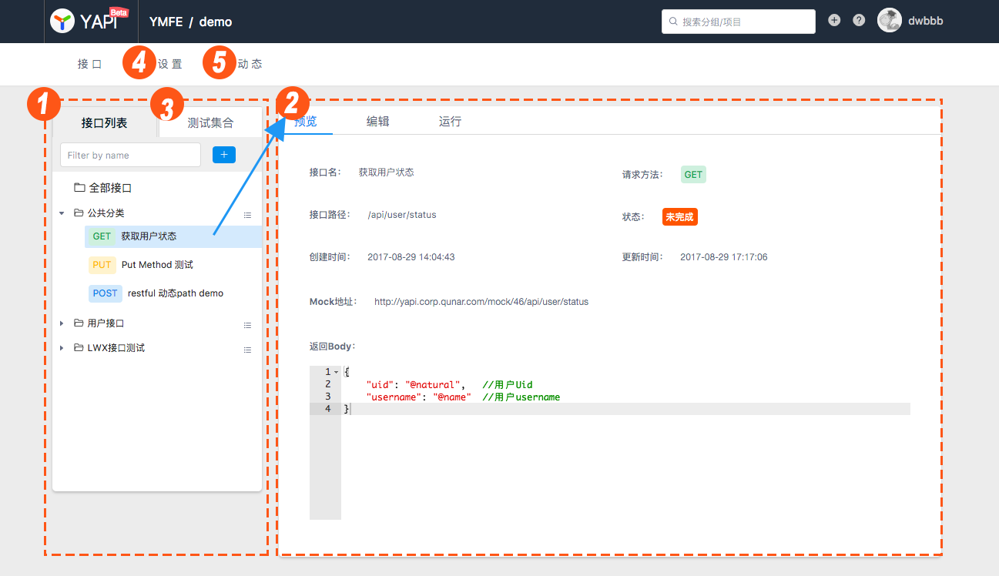
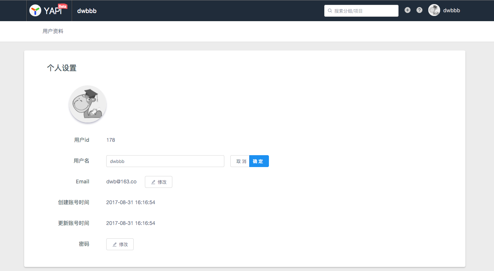

# YApi
在开始使用 YApi 之前，我们先来熟悉一下 YApi 的网站结构，这将让你快速了解YApi。

## 登录与注册
想要使用 YApi ，首先要注册账号。

## 首页

登录后进入首页，首页展示了分组与项目。

此时你作为新用户，没有任何分组与项目的权限，因此只能搜索、浏览 “公开项目” 的接口，如果在首页找不到任何项目，请联系管理员将你加入对应项目。

1首页头部展示了当前所在的位置、搜索框、新建项目、查看文档和用户信息。

2首页左侧展示分组信息，“分组”是“项目”的集合，只有超级管理员可以管理分组。

3首页右侧是分组下的项目和成员列表，点击左侧的某个分组，右侧会出现该分组下的项目和成员信息。

4点击项目右上角的星星即可关注项目，关注的项目可以在“我的关注”页面查看。

## 项目页

点击一个项目，进入项目页，项目页展示了属于该项目的全部接口，并提供项目、接口的全部操作。

此时你作为新用户，只能浏览接口信息，不可以编辑项目或接口，如果需要编辑，请联系管理员将你加入该项目。

1项目页左侧的 “接口列表” 展示了该项目下的所有接口，右侧默认显示该项目下所有接口的列表。

2点击左侧的某个接口，右侧会出现“预览”、“编辑”和“运行”。

3点击左侧的 “测试集合” 使用[测试集](./case.md)功能。

4点击二级导航的“设置”，项目组长即可编辑项目信息和管理成员列表。

5点击二级导航的“动态”，即可查看项目的操作日志。

## 个人中心
鼠标移动到右上角的用户头像或用户名上，即可点击“个人中心”查看个人信息。

在个人信息页面可以查看并修改自己的用户名、密码等信息。

