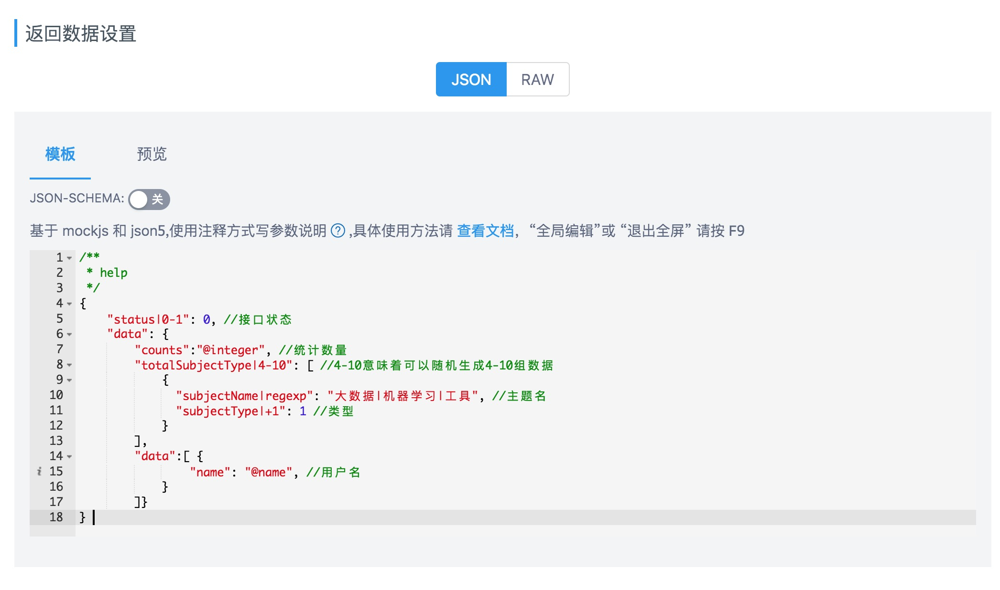
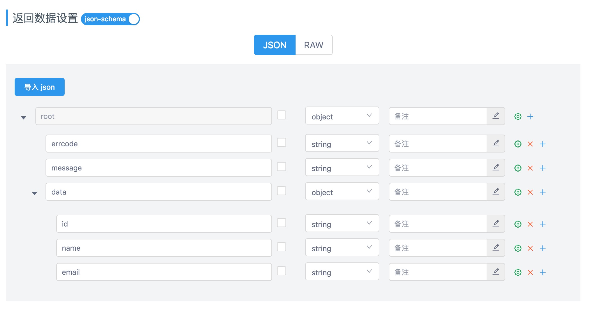
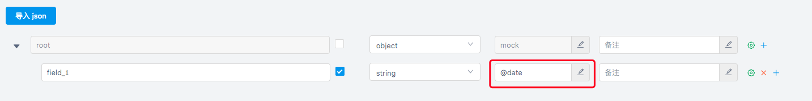
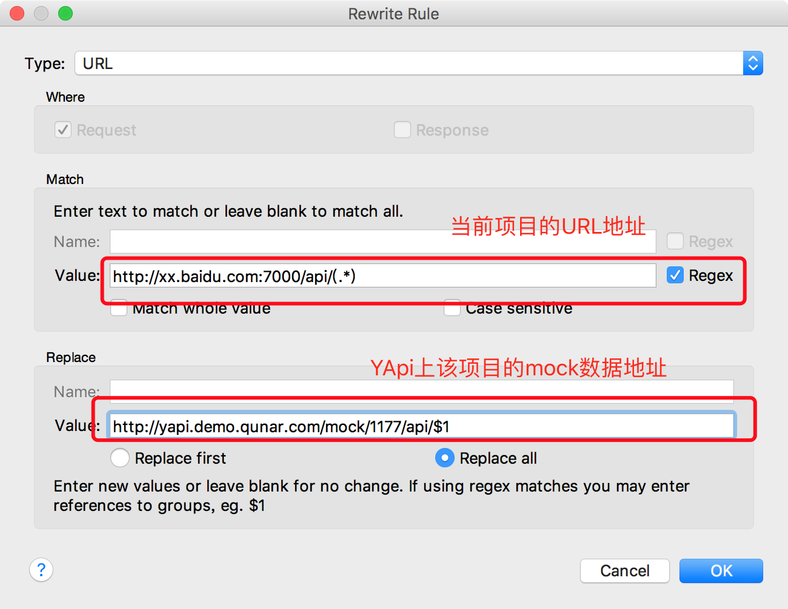
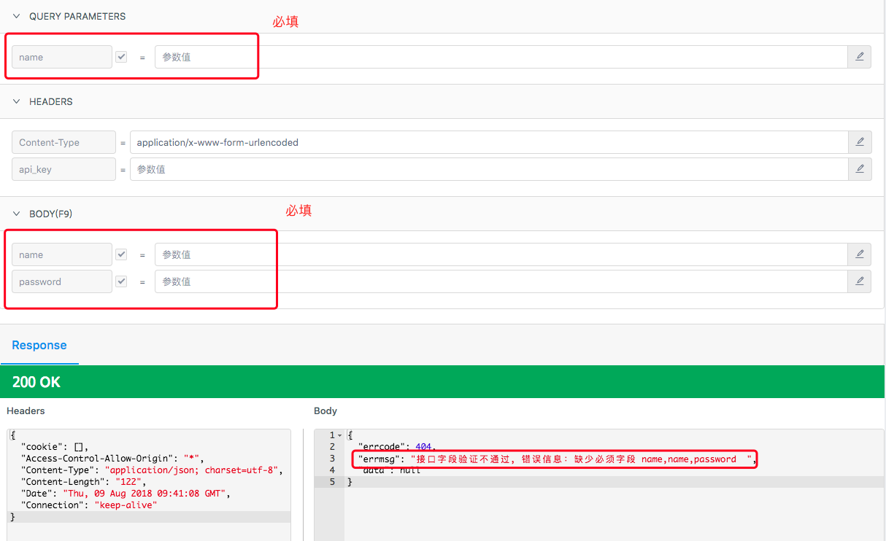
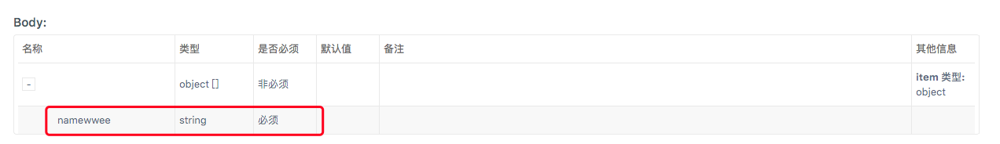

# Mock介绍

 <p style='text-indent:2em;line-height:1.8em'>YApi的 Mock 功能可以根据用户的输入接口信息如协议、URL、接口名、请求头、请求参数、返回数据（[返回数据](#mock)）生成 Mock 接口，这些接口会自动生成模拟数据，创建者可以自由构造需要的数据。 </p>
 
 **mock地址解析**：`YApi平台网址 + mock + 您的项目id + 接口实际请求path`

 假设你 YApi 的部署地址为：http://yapi.xxx.com 然后用这个地址作为示例

    mockd 地址： http://yapi.xxx.com/mock/29/api/hackathon/login

 > 注：项目 id 可以在项目设置里查看到
 
## 定义 mock 数据示例

项目 -> 接口编辑 -> 返回数据设置

返回数据设置有两种方式，最新版本默认是基于 `json+注释` 的方式，另外一种是基于 `json-schema` 定义数据结构,请根据实际情况灵活选择使用。


## 方式1. mockjs




### 原理
基于 [mockjs](http://mockjs.com)，跟 Mockjs 区别是 yapi 基于 json + 注释 定义 mock 数据，无法使用 mockjs 原有的函数功能。

1. 正则表达式需要基于 rule 书写，示例如下：

```
{
  "name|regexp": "[a-z0-9_]+?",
  "type|regexp": "json|text|xml"
}

```

2. 支持替换请求的 query, body 参数

```
{
  "name": "${query.name}", //请求的url是/path?name=xiaoming, 返回的name字段是xiaoming
  "type": "${body.type}",   //请求的requestBody type=1,返回的type字段是1
  
}

```


3. 示例
```
/**
 * 这是一个接口返回数据示例
 */

{
    "errcode": 0,
    "errmsg": "@word",
    "data": {
        "id": "@id", //@id 随机生成 id
        "name": "@name" //@name 随机生成用户名
    }
}

```


详细使用文档请查看：<a href="http://mockjs.com/examples.html" target="_blank">Mockjs 官网</a>

## 方式2. json-schema


开启 json-schema 功能后，根据 json-schema 定义的数据结构，生成随机数据。

### 如何生成随机的邮箱或 ip(该方法在v1.3.22之后不再适用)？


点击高级设置，选择 `format` 选项，比如选择 `email` 则该字段生成随机邮箱字符串。

### 集成 mockjs

基本书写方式为 mock 的数据占位符@xxx, 具体字段详见<a href="http://mockjs.com/examples.html" target="_blank">Mockjs 官网</a>



> 如果不是以@字符开头的话或者匹配不到Mockjs中的占位符就会直接生成输入的值


## 如何使用 Mock

### 1 在 js 代码直接请求yapi提供的 mock 地址（不用担心跨域问题）

在代码直接请求 yapi 提供的 mock 地址，以 jQuery 为例：

````javascript
let prefix = 'http://yapi.xxx.com/mock/2817'
$.post(prefix+'/baseapi/path', {username: 'xxx'}, function(res){
    console.log(res) //返回上图预览部分的数据
})
````

### 2 基于本地服务器反向代理

优点:不用修改项目代码

#### 2.1 基于 nginx 反向代理

```` nginx
location /baseapi
{
proxy_pass   http://yapi.xxx.com/mock/2817/baseapi; #baseapi后面没有"/"
}
````


#### 2.1 基于 Charles 代理

点击 Charles 工具栏下的 tools >> Rewrite Settings 填写如下信息：



## mock请求严格模式

版本 v1.3.22 新增 mock 接口请求字段参数验证功能，具体使用方法如下：

1. 打开 项目 -> 设置 开启 mock 严格模式
2. 针对 query, form 中设置的必须字段会进行必填校验


3. 针对 req_body_type 是json schema 格式的数据进行校验



  