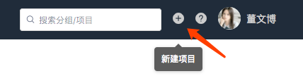
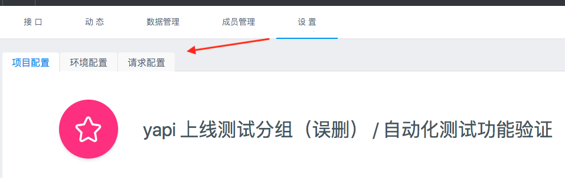
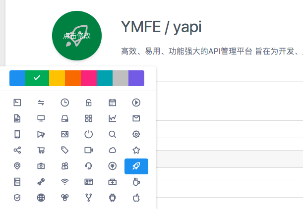
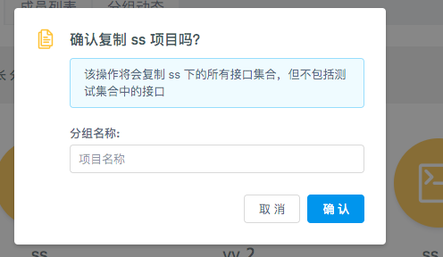
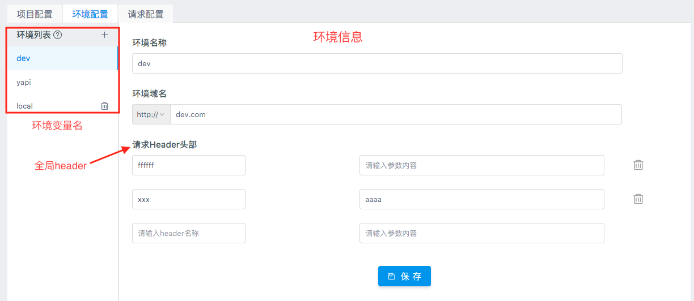

# 项目操作

## 新建项目

点击右上角的 `+` 新建项目，进入新建项目页面。



在新建项目页，填写项目信息：

> - 项目名称不允许重复，包括其他分组
> - 基本路径为接口统一添加了前缀
> - 新建项目页只列出了部分配置，其他详细配置(环境配置、项目图标等)需要进入项目页的“设置”面板进行配置。


## 修改项目

在项目页点击上方的 `设置` Tab 进入项目设置面板，这个面板涵盖了项目的所有配置。



这里比新建项目页面新增的功能如下：

### 修改项目图标

点击项目图标，可以修改图标及背景色：



## 项目迁移

YApi中支持项目迁移到不同的分组中。


迁移权限： 只有管理员和该项目的owner有权限对位置进行修改。项目owner主要有创建该项目的人、项目中的组长、创建分组的人、分组中的组长。

> Tips: owner权限判断的优先级是 项目权限 > 分组权限 

## 项目拷贝
该功能在 v1.3.12 版本上线，项目克隆功能可复制项目全部接口到一个新项目，如下图所示,点击红色框里面的 icon 使用。

YApi支持项目复制功能，但是无法复制项目中的测试集合list。  

操作： 点击下图左上角的复制按钮，在弹窗中写入复制项目名称点击确定就可以完成项目复制




> Tips: 如果你在该分组下有新建项目的权限，那你也同时拥有复制项目的权限 

## 删除项目

点击下方的删除按钮，输入项目名称进行删除。

> 删除项目是高风险操作，因此 YApi 对这个操作进行了特别的约束。

## 配置环境

`环境配置` 一项可以添加该项目下接口的实际环境，供 [接口测试](./case.md) 使用，这里增加了全局header，可以在项目中设置全局header值。在接口运行页面的选择环境select中也增加`环境配置`弹层。



## 请求配置

通过自定义 js 脚本方式改变请求的参数和返回的 response 数据

### 请求参数示例
以 jquery ajax 为例，假设当前的请求参数是
```
{
  url: '/api/user?id=1',
  method: 'POST',
  headers: {
    xxx: 'xxx'
  },
  data: {
    type: 1
  }
}
```


那么公共变量 context 包含以下属性：
```
context = {
  pathname: '/api/user',
  query: {
    id: 1
  },
  requestHeader: {
    xxx: 'xxx'
  },
  method: 'POST',
  requestBody: {
    type:1
  }
}
```

假设我们需要在一组接口的 url 上增加一个公共的 token 参数，可以写如下自定义脚本：

```
context.query.token = context.utils.md5(context.pathname + 'salt');

```
### 返回数据示例

在上面的示例请求完成后，假设返回 responseData={a:1},公共变量 context 包含以下属性：
```
context = {
  pathname: '/api/user',
  query: {
    id: 1
  },
  requestHeader: {
    xxx: 'xxx'
  },
  method: 'POST',
  requestBody: {
    type:1
  },
  responseData: {
    a:1
  },
  responseHeader: {
    content-type: 'application/json'
    ...
  }
}
```

假设我们需要修改响应数据 responseData a 的值为 2，可以填写如下自定义脚本：

```
context.responseData.a = 2;

```
> （v1.3.16+新增）context.href和context.hostname  
> （v1.3.17+新增）context.caseId 测试用例的唯一 key 值
### 工具函数
```
context.utils = {
  _         //underscore 函数,详细 API 查看官网 http://underscorejs.org/
  base64    //转换字符串为 base64 编码
  md5       //转换字符串为 md5 编码
  sha1      //转换字符串为 sha1 编码
  sha224    //转换字符串为 sha224 编码
  sha256    //转换字符串为 sha256 编码
  sha384    //转换字符串为 sha384 编码
  sha512    //转换字符串为 sha512 编码
  unbase64  //转换 base64 编码为字符串  
  axios     // axios 库，可用于 api 请求，官网 https://github.com/axios/axios
}
```

### 异步处理（v1.3.13+支持）

处理请求参数，或返回数据，可能还会涉及到异步处理，比如 ajax 请求，YApi 在 v1.3.13 版本支持了异步处理。

```javascript
context.promise = new Promise(function(resolve){
    var api = context.utils.axios.get('http://yapi.local.qunar.com:3000/api/user/status')
    api.then(function(result){
        //...
        console.log(result.data)
        resolve()
    })

})
```
promise 还可以来设置接口延迟

```javascript
context.promise = new Promise(function(resolve){
    setTimeout(function(){
      console.log('delay 1000ms')
      resolve('ok')
	}, 1000)
})
```


使用方法就是在 `context` 里面添加 `promise` 参数,并且返回一个 Promise，不熟悉 Promise 的童鞋可以查下相关用法，ajax 请求可以使用 `context.utils.axios` 库。

> 处理完成后，不要忘记 `resolve()`，不然会一直处于挂起状态


## token配置

每个项目都有唯一的标识token，用户可以使用这个token值来请求项目的所有资源数据。目前用到的地方是接口的<a  href="./case.md">自动化测试</a>，用户不需要登录就可以访问接口测试结果信息。
