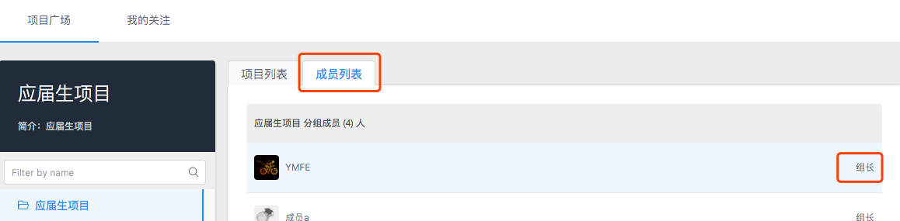
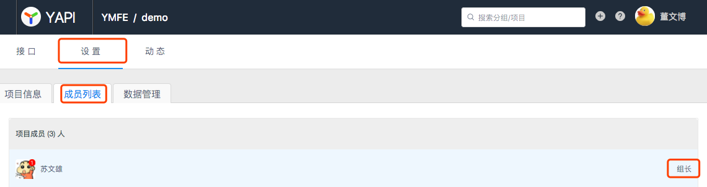

# 常见问题解答

本页面罗列了大家使用 YApi 时遇到的常见问题.

如果没有找到您要的答案，请联系管理员.

## Q1 怎样联系组长？

组长分为 `分组组长` 和 `项目组长`:
- 分组组长：选择首页左侧的分组，点击右侧面板的 `成员列表`，成员右侧显示着 `组长/开发者` 的权限信息。

- 项目组长: 点击项目页的 `设置` - `成员列表`，成员右侧显示着 `组长/开发者` 的权限信息。

## Q2 怎么快速迁移旧项目？

第一步. 使用 Chrome 浏览器开发者工具录制功能

第二步 录制当前项目所有请求，导出到 har 文件

第三步 将Har数据导入到 YApi 平台

具体使用方法请参考 YApi <a  href="./data.md#har-数据导入">文档</a>

## Q3 忘记密码怎么办？

请联系 `超级管理员` ，只有超级管理员能重置密码。

## Q4 发现了 Bug 怎么办？

请反馈到 <a href="https://github.com/YMFE/yapi/issues" _blank="target">Github</a>，功能性的问题我们会在一周内修复，并在每周一发布新的版本 Tag.

## Q5 部署不成功怎么办？

1. 确保 node 版本=> 7.6,请运行 node -v 查看版本号
2. 确保 mongodb 版本 => 2.6，请运行 mongo --version 查看版本号
3. 确保安装了 npm, 运行 npm -v 查看版本号
4. 确保安装了 git,运行 git --version 查看版本号

确认版本号没问题，请删除原有的安装文件和数据库，重新安装。
如果还是无法安装，请不要选择最新的版本，可选择上一个版本或上上一个版本等，最新版本出问题的概率会比较大。

## Q6 部署YApi遇到mongodb认证问题？

* <a href="http://blog.csdn.net/ll657418802/article/details/50846313?locationNum=7" _blank="target">mongodb3.03以上开启认证,解决程序认证连接报错以及第三方客户端无法认证问题</a>
