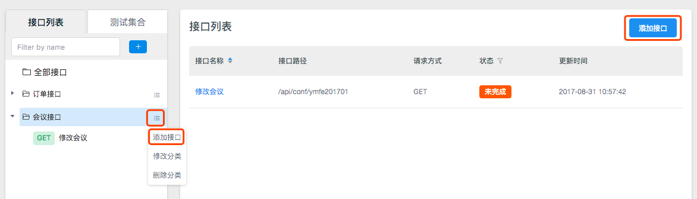
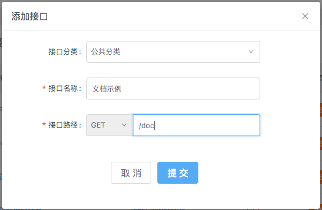
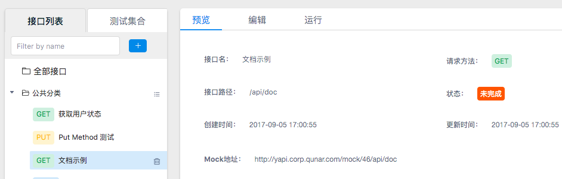

# 如何创建接口？

把大象装进冰箱分几步？三步：把冰箱门打开，把大象装进去，关门，搞定~

新建接口分几步？也是三步：

* [获取权限](#获取权限)
* [找到一个项目](#选择项目)
* [新建接口](#新建接口)

搞定~

## 获取权限

新用户登录拥有 `个人空间` 分组下的全部权限，个人空间分组仅自己可见，因此可以在这里任意试用 YApi 的功能。

除此以外没有任何项目或分组的权限，只能浏览已存在分组下面的公开项目。

如果找不到想找的项目，可能是尚未成为项目成员，此时应联系 `项目组长` 将你加入该项目。

[怎样联系组长？](./qa.md#Q__怎样联系组长？)

- 想创建分组，请看: [创建分组](./manage.md#创建分组)
- 想创建项目，请看: [创建项目](./manage.md#创建项目)

> 想了解更多权限信息，请查看[权限列表](./manage.md#权限列表)

## 选择项目

- 如果你已经登录，会在首页右侧看到一些项目 (可以在左侧的分组列表切换分组来查看不同分组下的项目)。

- 点击一个项目，进入该项目的详情页。

## 新建接口

- 点击左侧接口分组右侧的菜单按钮，选择 `添加接口`，或者点击接口列表右上角的 `添加接口`。

- 选择接口分类，输入接口名称和接口路径，点击 `提交`。

- 恭喜你！创建了第一个YApi的接口，你可以看到在左侧看到接口名称，右侧有该接口的信息预览。

